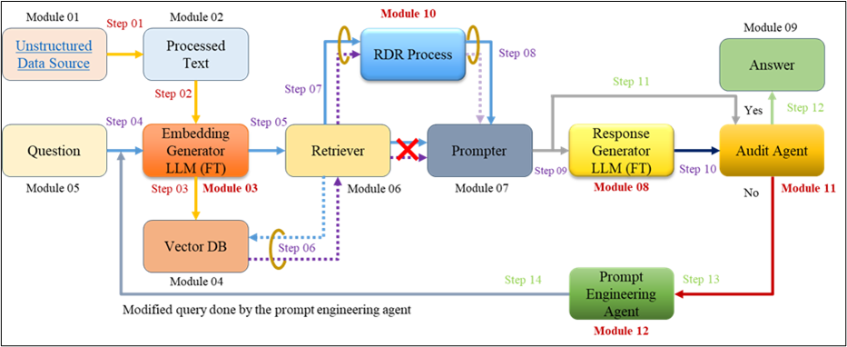

# 🏛️ Legal Query RAG (LQ-RAG)

[](https://creativecommons.org/licenses/by/4.0/)
[](https://www.python.org/downloads/)

> Official implementation of **"Legal Query RAG: A Retrieval-Augmented Generation Framework with Recursive Feedback for Legal Applications"**  
> Published in *IEEE Access* · [Read the paper ↗](https://ieeexplore.ieee.org/stamp/stamp.jsp?tp=&arnumber=10887211)

### 👥 Authors
- [**Rahman S M Wahidur**](https://scholar.google.com/citations?user=0_GwJz4AAAAJ&hl=en&oi=ao), [**SUMIN KIM**], [**HAEUNG CHO**], [**DAVID S. BHATTI**](https://scholar.google.com/citations?user=RU0j8cMAAAAJ&hl=en), [**Heung-No Lee**](https://scholar.google.com/citations?user=lRlN_40AAAAJ&hl=en)

---

## 🔍 Overview
LQ-RAG explicitly incorporates an agent-based iterative refinement mechanism during inference. It first generates an initial response to a user query and then utilizes an evaluation agent to assess its quality based on contextual relevance and factual grounding. If the response does not meet predefined criteria, the evaluation agent provides feedback to the prompt-engineering agent, which modifies the query to improve the next response. This iterative feedback loop continues until the evaluation scores approach optimal values.

---

## 🧠 Architecture Components

- **Evaluation Agent** – custom scorer to evaluate factual correctness and legal context
- **Response Generator** – LLM fine-tuned on legal texts
- **Prompt Engineering Agent** – dynamically adapts queries based on evaluation feedback
- **Legal Embedding Model** – specialized vector store for legal document retrieval

<p align="center">
  
</p>

---

## 📈 Key Results

- 📌 **+13%** Hit Rate improvement
- 📌 **+15%** boost in Mean Reciprocal Rank (MRR)
- 📌 **+24%** performance gain over general LLM baselines
- 📌 **+23%** relevance score improvement vs. naive RAG setups

---


# Legal Query RAG (LQ-RAG)

[](https://creativecommons.org/licenses/by/4.0/)
[](https://www.python.org/downloads/)

Official implementation of "Legal Query RAG: A Retrieval-Augmented Generation Framework with Recursive Feedback for Legal Applications"
[**Rahman S M Wahidur**](https://scholar.google.com/citations?user=0_GwJz4AAAAJ&hl=en&oi=ao), [**SUMIN KIM**], [**HAEUNG CHO**], [**DAVID S. BHATTI**](https://scholar.google.com/citations?user=RU0j8cMAAAAJ&hl=en), [**Heung-No Lee**](https://scholar.google.com/citations?user=lRlN_40AAAAJ&hl=en)


Published in **IEEE Access**. You can access it [here](https://ieeexplore.ieee.org/stamp/stamp.jsp?tp=&arnumber=10887211).
## Overview

LQ-RAG explicitly incorporates an agent-based iterative refinement mechanism during inference. It first generates an initial response to a user query and then utilizes an evaluation agent to assess its quality based on contextual relevance and factual grounding. If the response does not meet predefined criteria, the evaluation agent provides feedback to the prompt-engineering agent, which modifies the query to improve the next response. This iterative feedback loop continues until the evaluation scores approach optimal values. The system incorporates:

1. Custom evaluation agent
2. Specialized response generation model
3. Prompt engineering agent
4. Fine-tuned legal embedding LLM


Key features:
- 13% improvement in Hit Rate
- 15% improvement in Mean Reciprocal Rank (MRR)
- 24% performance gain over general LLMs
- 23% improvement in relevance score over naive configurations

## Installation

```bash
git clone https://github.com/yourusername/legal-query-rag.git
cd legal-query-rag
pip install -r requirements.txt
